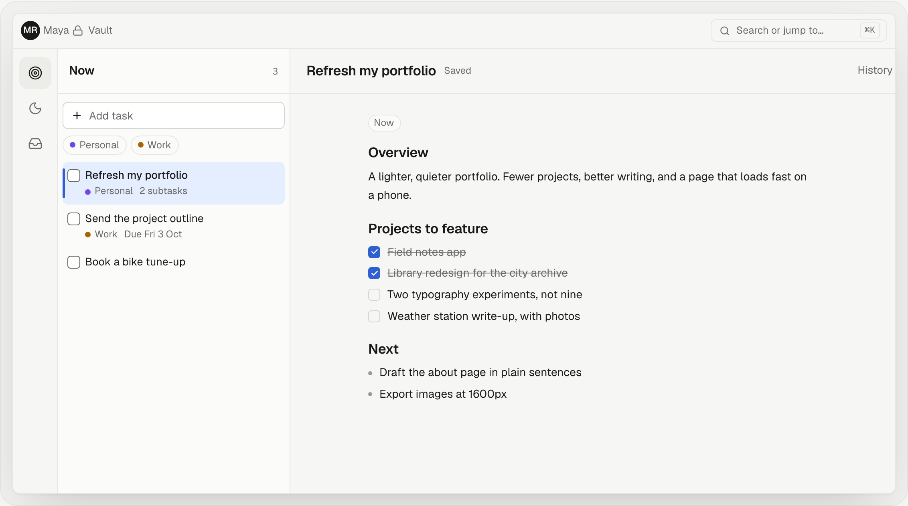
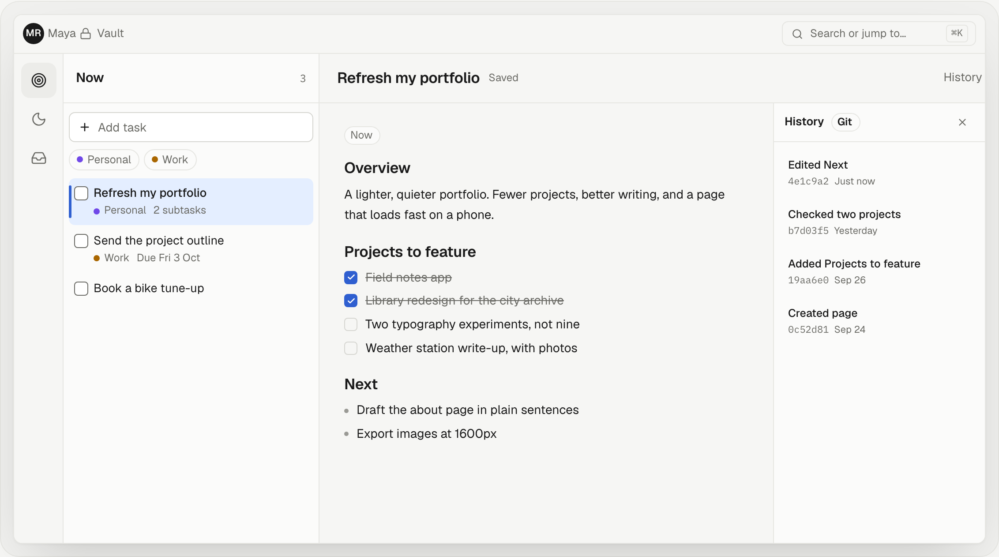
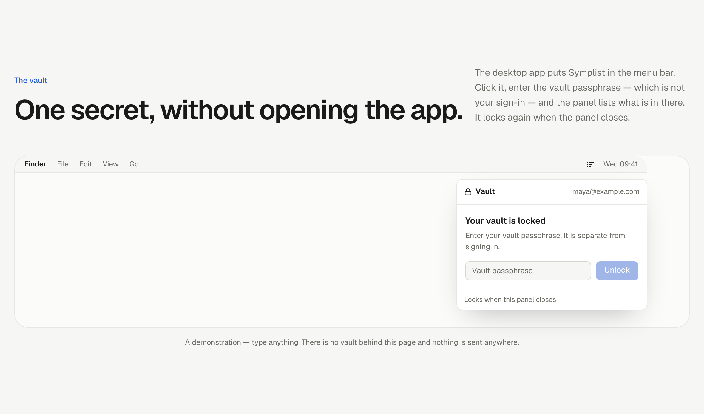
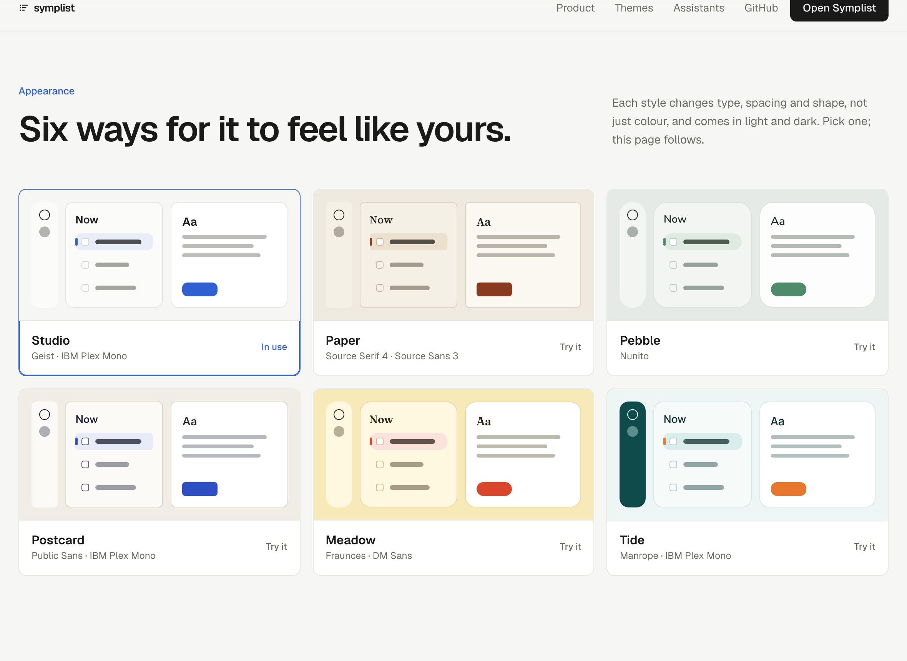

# Symplist

**The most productive thing is often the most simple.**

A calm, open-source task workspace. Every task has one editable Markdown page with real Git history. Keep the surface simple; open deeper features only when you need them.

**Symplist publishes its tools and runs no assistant.** An assistant that cannot run a command is a chat window with opinions — and the tool that *can* is already on your machine. So the API exposes your tasks, your document's sections, its history and search over **MCP**, with an OAuth consent flow: point Claude Desktop, Claude Code or any MCP client at Symplist and it can read and edit your workspace alongside your real shell and your real repository. Your model key stays with your client; Symplist never holds one. See [the note](docs/notes/files/18_local_first_desktop.md) for why an embedded agent was built and then deleted.

[Quickstart](#run-locally) · [Self-hosting guide](SELF_HOSTING.md) · [Product specification](docs/notes/files/01_product.md) · [Contributing](CONTRIBUTING.md) · [Security](SECURITY.md) · [MIT license](LICENSE)



<p align="center"><em>Three lists, and a real Markdown page behind every task.</em></p>

## What you get

- **A focused workspace** — Now / Later / Unclassified inboxes, subtasks, drag-and-drop and keyboard movement, archive/restore, and a responsive task list and page.
- **Documents with real history** — Markdown backed by an actual Git engine, encrypted artifacts in object storage, and indexed publication in D1.
- **Useful handoffs** — editable specialist prompts, reviewed read-only artifact snapshots, expiring links, password protection, or explicit public publication.
- **Time-aware tasks** — optional deadlines, calendar views, quiet hours, snooze, persistent notifications, and reminder emails.
- **Labels** — your own words for slices of your list, with a colour each, shown on the task and filtered from a bar above it.
- **Fast navigation** — contextual keyboard shortcuts, a command palette, and scoped task/document search.
- **Personal appearance** — Studio, Paper, Pebble, Postcard, Meadow, and Tide styles, independent preset/custom accent colors, and Light/Dark/System modes.
- **Private storage** — encrypted task content at rest and a separately unlocked Vault for sensitive notes and keys.
- **Your assistant, connected** — 20 scoped tools over MCP with OAuth consent, per-grant task scoping, and revocation you control.

## A closer look

<table>
<tr>
<td width="50%"></td>
<td width="50%"></td>
</tr>
<tr>
<td><strong>Real Git history.</strong> Every save is a commit. Pick an older version and restore it; nothing is thrown away either way.</td>
<td><strong>A vault of its own.</strong> On macOS, the menu bar opens a small panel for one secret without opening the workspace.</td>
</tr>
</table>



<p align="center"><em>Six themes. Each changes type, spacing and shape, not just colour, and each comes in light and dark.</em></p>

## Install

| | |
| --- | --- |
| **macOS** | [Download the signed .dmg](https://github.com/tejassudsfp/symplist/releases/latest/download/Symplist-arm64.dmg) — Apple silicon, signed and notarized |
| **iOS · iPadOS · Android** | Open [symplist.app](https://symplist.app) and add it to your home screen |
| **Windows · anywhere else** | [symplist.app](https://symplist.app) in any browser |

## Project status

**Released and self-hostable.** The monorepo contains the workspace application: the Next.js web app, the NestJS API, an optional Trigger.dev worker, the shared packages, 51 expand-only database migrations, deployment configuration, and an automated test suite (unit, integration, browser, accessibility, visual, image, and smoke checks).

There is also a desktop application (`apps/desktop`): the same frontend in an Electron window with the session held out of the renderer. It hosts no assistant either.

No agent is in this repository. The server-side agent loop, chat, approvals and model credentials went first; an embedded desktop agent was built and removed after it proved strictly less capable than the client people already use; the Composio connector layer went with it, its executor having been dead code since the agent left. Every table those features used remains, because migrations here are expand-only, and is no longer written.

The hosted service at [symplist.app](https://symplist.app) is **open and free**: verify an email address and start. There is no invite, no waitlist, and no paid tier above it — billing, paywalls and AI-usage quotas are not part of the project.

## Architecture

| Layer | Selected technology |
| --- | --- |
| Web application | Next.js (React, Tailwind, shadcn on Base UI) |
| Public backend | NestJS; owns authentication, APIs, and WebSockets |
| Structured storage | Cloudflare D1 through direct REST |
| Encrypted object storage | Cloudflare R2 |
| Assistant interface | MCP over HTTP, with OAuth dynamic client registration and a consent screen |
| Durable execution | Trigger.dev when `DURABLE=true`; Nest-local execution otherwise |
| Transactional email | Resend |
| Product analytics | PostHog (optional, default-off, explicit event allowlist) |

`DURABLE=false` runs the scheduled jobs — Git commits, index rebuilds, reminder scans, purges — inside Nest with no Trigger credentials, which is the simplest self-hosted topology. `DURABLE=true` delegates that work to Trigger.dev; Nest remains the browser delivery boundary. The durable executor keeps only ids, enums, and counts: user content never transits or rests on Trigger in plaintext. No deployment holds a model credential, because no deployment runs a model.

See the [document versioning](docs/notes/files/11_document_versioning.md) and [analytics](docs/notes/files/17_analytics.md) contracts, and the [self-hosting guide](SELF_HOSTING.md) for full deployment topologies.

## Repository layout

| Path | Contents |
| --- | --- |
| `apps/web` | Next.js application (workspace, documents, Vault, settings) |
| `apps/api` | NestJS API (auth, sessions, WebSocket, executor boundary) |
| `apps/worker` | Trigger.dev worker (durable mode) |
| `apps/desktop` | Electron shell around the same frontend, with the session held out of the renderer |
| `apps/e2e` | Playwright browser, accessibility, and visual suites |
| `packages/` | `contracts` `config` `crypto` `db` `core` `storage` `email` `analytics` `search` `docs` `testing` |
| [`docs/notes/files/`](docs/notes/files/00_index.md) | Numbered product decisions and technical specifications |
| [SELF_HOSTING.md](SELF_HOSTING.md) | Tested local setup, production deployment, operations, backup, and recovery |
| [ROADMAP.md](ROADMAP.md) | What shipped and what is planned |

## Run locally

Symplist requires Node.js 24 (`>=24.15.0 <25`) and pnpm 12.4.2. From a clean checkout:

```sh
corepack enable pnpm
corepack install --global pnpm@12.4.2
pnpm install --frozen-lockfile
```

Create a private `.env.local` from [`.env.example`](.env.example), generate fresh deployment secrets with `pnpm secrets:generate`, fill the empty assignments, and never commit or share the result. Then:

```sh
chmod 600 .env.local
pnpm env:distribute
pnpm env:check
pnpm dev
```

The template defaults to local SQLite/filesystem storage, console-delivered OTPs, and `DURABLE=false`, so no Cloudflare, Resend, or Trigger account is needed to boot. There is no model credential to add: the server runs no models.

Read [SELF_HOSTING.md](SELF_HOSTING.md) before accepting real data or deploying to Vercel, Render, Cloudflare, Resend, Trigger.dev, or PostHog.

## Development

```sh
pnpm dev            # web + api + worker supervisor
pnpm lint           # Biome — zero errors AND zero warnings
pnpm typecheck
pnpm test           # all workspace tests + script tests
pnpm build          # production web build + api build
pnpm e2e            # Playwright across three viewports (slow)
pnpm smoke:local
```

The full contribution checklist — including the release gate every change is held to — is in [CONTRIBUTING.md](CONTRIBUTING.md).

## Privacy and analytics

PostHog is supported for optional product analytics. The implementation uses a small explicit event allowlist, with autocapture, session replay, and automatic page/URL collection disabled. Task text, documents, secrets, emails, share keys, and private URLs never enter analytics. Standalone artifact viewers and Vault/authentication surfaces do not load the analytics client.

Analytics is optional for self-hosting and disabled by default until explicitly configured. It must not be required for any feature, introduce billing quotas, or be confused with AI-provider usage metering. See the [analytics specification](docs/notes/files/17_analytics.md) and [privacy design](PRIVACY.md). Encryption protects stored content; it is not a blanket end-to-end encryption claim.

## Contributing

Start with [CONTRIBUTING.md](CONTRIBUTING.md) and the [notes index](docs/notes/files/00_index.md). Focused issues and pull requests are welcome. Check existing issues before opening a proposal; large architecture changes should explain their impact on the agreed scope.

Use [GitHub issues](https://github.com/tejassudsfp/symplist/issues) for bugs and proposals. Follow the [Code of Conduct](CODE_OF_CONDUCT.md). Report security concerns privately using [SECURITY.md](SECURITY.md).

## License and maintainer

Symplist is open source under the [MIT License](LICENSE).

Created and maintained by [Tejas Parthasarathi Sudarshan](https://tejassuds.com) · [@tejassudsfp](https://github.com/tejassudsfp).
