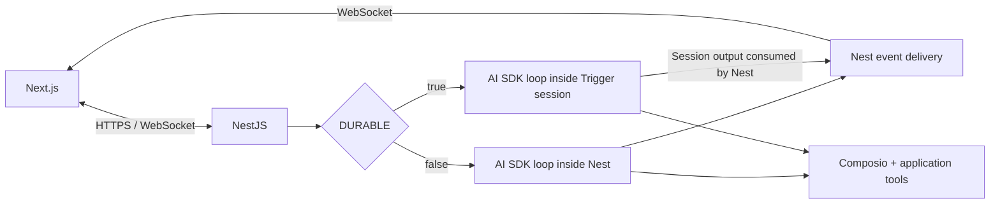

# symplist — architecture

Updated September 14, 2026. Architecture decisions and proposed contracts; no application code is implemented yet.

## Confirmed requirements

| Concern | Choice |
| --- | --- |
| Frontend | Next.js with the agreed inbox, document, and chat workspace |
| Appearance | User-selected design themes; each supports light/dark variants and system preference |
| Backend | NestJS; owns public APIs, authentication enforcement, and WebSocket connections |
| Database | Cloudflare D1 via direct REST API; no proxy Worker |
| Backend hosting | Render initially; portable Node deployment for AWS later |
| Login and signup | Email lookup; explicit signup consent for new users; Resend OTP; onboarding |
| Access | Closed beta: verified signup stays locked until invite redemption or admin unlock |
| Plans | Beta is free for unlocked accounts; billing, paywall, and plan quota monitoring disabled |
| Vault unlock | Custom key set on first access; reset through a fresh Resend email OTP |
| License | MIT — Tejas Parthasarathi Sudarshan, https://tejassuds.com |
| Objects | Cloudflare R2, including encrypted Git bundles for task documents |
| Document history | Actual Git commits; D1 indexes and conditionally publishes repository heads |
| Agent loop | Vercel AI SDK |
| Agent identity | Simon; shared meta-tool and rule contracts across both executors |
| Integrations | Composio tools and user connections |
| Execution | Nest in-process when `DURABLE=false`; Trigger.dev when `DURABLE=true` |
| Models | Fast and Smart tiers; provider and model for each configured in server environment |
| Users | Multi-user with isolated content and connections |
| Sandboxes | None; no arbitrary shell or code execution tools |

Interpret “everything executes in Trigger” as all agent/model/tool execution. Nest still handles API requests, authorization, storage services, and WebSocket delivery in both modes.

## Execution contract



Use a shared agent module for prompts, model resolution, tool definitions, limits, and document-edit rules. Two executor adapters own runtime lifecycle. The frontend uses one protocol regardless of execution mode.

- Local executor invokes AI SDK within the Nest process. It requires no Trigger credentials, session creation, or network access to Trigger.
- Durable executor runs AI SDK and tools in Trigger. Nest sends messages and controls server-side and consumes session output. Do not enable a fast-start mechanism that executes the first model step inside Nest in durable mode.
- Trigger documents both chat agents backed by sessions and backend-readable session channels. Its chat wrapper can integrate with AI SDK; exact adapter compatibility must be verified against pinned package versions.
- **Built, September 22, 2026.** `simon-chat` runs Simon as a durable chat session keyed on the Symplist conversation id, so a follow-up inside the idle window answers from a parked run instead of paying a cold boot. It is permitted only with a registered transcript storage: the default persistence writes the whole conversation to the provider's object storage after every turn, plaintext and overwritten rather than expired, which the account-deletion promise cannot accommodate. Ours stores it in D1 under the account data key and purges it. Approvals remain Symplist rows and delivery remains the Nest relay, so neither the authorization record nor the browser transport moves. The session's own streams still carry turn content for the provider's retention window; that is the accepted cost and is recorded in PRIVACY.md. [Chat backend](https://trigger.dev/docs/ai-chat/backend), [sessions](https://trigger.dev/docs/ai-chat/sessions), [session channels](https://trigger.dev/docs/management/sessions/channels).
- No direct frontend connection to Trigger, model providers, or Composio for agent execution. Hosted connection authorization is a separate user-facing OAuth flow.
- Public chat IDs belong to Symplist. Store optional Trigger session IDs and execution generations separately. One task has one conversation, which may span multiple execution runs.
- Record the executor and resolved provider/model on each run. Environment changes apply to new runs; never start a second executor for an already-active run. A change between modes must drain/cancel existing work and rehydrate the same Symplist conversation.

## Persistence and reconnects

Proposed D1 records: users/auth references, tasks and parent IDs, ordering/list placement, conversations, message parts, document revisions, execution runs, approvals, tool invocations, connection references, usage, and replay checkpoints. Store encrypted object payloads and attachments in R2 with ownership metadata in D1. Large tool outputs can become object references.

Persist accepted user messages before execution. A transactionally recorded dispatch intent plus an idempotent dispatcher prevents a crash between acceptance and launch from silently losing work. For local mode the dispatcher stays in Nest.

Give events stable IDs and conversation/run identifiers. Persist bounded batches or snapshots rather than making a D1 request for every token. Reconnect returns a stored snapshot and replays the available tail using a cursor, with deduplication. If history has expired, send a fresh snapshot. Uncheckpointed local deltas can be lost in a crash; never label them as durable.

In durable mode, keep Trigger output cursors separate from browser delivery cursors. Persist recovery state as part of execution, not only when a WebSocket viewer is present. A backend restart must be able to reconcile active sessions and read missed output within retention limits. Export durable conversation state to Symplist storage; Trigger stream retention is not the archive policy.

Next.js can use an AI SDK custom chat transport over the Nest WebSocket protocol. The default HTTP transport does not implement this for us. [AI SDK transport](https://ai-sdk.dev/docs/ai-sdk-ui/transport).

Browser disconnect is not cancellation. With `DURABLE=false`, a Nest crash interrupts active work; record it as interrupted on recovery and offer an explicit retry. Durable mode must reconcile provider/tool outcomes before resuming. Stop requests cannot undo external actions that already completed.

## Gaps and proposed defaults

1. **Authentication and ownership.** Existing email: Resend OTP then login. Unknown email: explicitly ask whether to create an account; consent creates a pending account, OTP verification activates it, then the account remains beta-locked until invite redemption or admin unlock. After unlock, onboarding asks for name and optional connectors, with no beta plan screen. This requested lookup intentionally reveals account existence and replaces the earlier generic-response proposal. OTP challenges need expiry, bounded attempts, purpose separation, atomic consumption, and redacted logs. Enforce ownership for HTTP, WebSocket, MCP, storage, and executor actions. See [ACCESS-AND-BILLING.md](03_access_and_billing.md).
2. **Hosting and D1 access.** Confirmed: Nest on Render initially, AWS later; direct D1 REST queries with scoped server-held Cloudflare credentials and parameterized SQL. The proposed proxy Worker is removed. Batch suitable queries and handle latency/rate limits; do not write individual token events as individual REST requests. R2 uses its S3-compatible API. Keep durable state off the host filesystem, listen on the supplied port, and implement graceful shutdown for portability. [D1 query API](https://developers.cloudflare.com/api/resources/d1/subresources/database/methods/query/), [R2 API](https://developers.cloudflare.com/r2/api/s3/api/), [Render WebSockets](https://render.com/docs/websocket).
3. **Encryption and vault.** Users set a custom vault key on first access. Use AES-256-GCM for contents and Argon2id to derive a passphrase-based wrapping key. Store wrapped random data keys rather than the plaintext custom key. A separate service-managed recovery wrapper enables a fresh Resend OTP to authorize setting a new key while preserving existing contents. This supersedes the earlier no-recovery proposal. Ordinary account login does not unlock the vault. The service can recover the vault data key, so user-only decryption is not promised. See [VAULT.md](05_vault.md) for setup, reset, storage, and verification requirements. Ordinary task/chat content retains separate application-managed encryption; sharing vault items with agents remains explicit. Trigger streams, logs, and provider retention remain in the threat model.
4. **Execution permissions and retries.** Bind approval to exact tool arguments, user, account, and expiry. Maintain an invocation ledger and use provider idempotency where supported. Trigger task deduplication does not prove an external side effect happened exactly once: an API can succeed before its result is recorded. An uncertain write must be reconciled or require a user decision before replay. [Trigger idempotency](https://trigger.dev/docs/idempotency).
5. **Concurrency and scaling.** Start with one active turn per conversation and queue follow-up messages consistently in both modes. Use durable ownership/lease checks and fencing for writes, not only in-memory locks. For multiple Nest replicas, introduce shared event fan-out and coordinate executor ownership; Redis is a candidate if needed. A single Nest replica is an explicit initial deployment constraint, not a scaling solution. [Nest adapters](https://docs.nestjs.com/websockets/adapter).
6. **Model limits and context.** Resolve Fast/Smart through an allowlisted provider registry and verify tool-call support. Both model choices are available to unlocked beta users; no billing tiers, credit metering, or weekly allowance are active. Enforce beta access and per-run safety bounds in either executor. Invite redemption tracking is always available; operational AI telemetry is optional and off by default. See [ACCESS-AND-BILLING.md](03_access_and_billing.md) and [BETA-ACCESS.md](04_beta_access.md). Read task documents through bounded section-based MCP tools, never full automatic prompt injection; see [DOCUMENT-TOOLS.md](06_document_tools.md). Surface provider failures instead of silently switching tiers or providers.
7. **Document consistency.** Symplist MCP tools read and update bounded sections of the task page through the same authorized domain services as manual edits. Use expected revision checks; a stale agent write returns a conflict rather than overwriting newer user text.
8. **Composio identity.** Map each Symplist user to a stable Composio user ID, and validate connected-account ownership before execution. Make the account choice explicit when a user connects multiple accounts to the same service. Native Symplist tools coexist with Composio integration tools; the model cannot choose arbitrary credentials. [Composio authentication](https://docs.composio.dev/docs/authentication).
9. **Operational basics.** Define backups and restore verification, object/database deletion lifecycle, redacted diagnostics, usage accounting, and encrypted-content search behavior. Incoming MCP must reuse the same ownership and action authorization rules as chat.

## Direct Trigger output: option under discussion

The latest user asks whether direct Trigger-to-browser output solves WebSocket scaling. This is an evaluated alternative, not yet a replacement for the previously required backend-only route.

Yes for the durable chat delivery path: Trigger holds the browser SSE streams, removing those long-lived output connections and their fan-out from Nest. It does not solve local-mode delivery, application-wide synchronization, database throughput, authorization, or agent concurrency.

Recommended alternative if selected: commands (send, stop, approve) continue through Nest. Nest authorizes ownership and mints short-lived, session-specific output-only tokens; the browser subscribes to Trigger output directly. Never expose Trigger secret keys. A custom transport is needed for this split: the documented default Trigger chat transport also grants input/write access. Token expiry bounds remaining access after logout/revocation unless an additional revocation mechanism is implemented. [Trigger frontend](https://trigger.dev/docs/ai-chat/frontend), [output-only scope and SSE](https://trigger.dev/docs/management/sessions/channels).

With `DURABLE=false`, retain Nest delivery. We can hide the two transports behind the same UI interface. Continuing to proxy every output through Nest would retain the original connection-scaling requirement.

## Proposed environment values

```dotenv
DURABLE=false
AI_DEFAULT_TIER=fast
BETA_ACCESS_REQUIRED=true
BILLING_ENABLED=false
PAYWALL_ENABLED=false
AI_USAGE_LIMITS_ENABLED=false
AI_TELEMETRY_ENABLED=false
AI_FAST_PROVIDER=<registered-provider>
AI_FAST_MODEL=<model-id>
AI_SMART_PROVIDER=<registered-provider>
AI_SMART_MODEL=<model-id>
```

Provider credentials and optional endpoint overrides are server-only. Validate configuration at startup, parse booleans strictly, and require Trigger configuration only for durable mode. Both deployment environments need the configuration for whichever executor they host. Authentication, encryption key storage, D1 access, and R2 credentials will be added once those integration decisions are concrete.

## Required implementation checks

Run the same chat/tool/document contract tests under both executors. Exercise locked-account and cross-user access rejection; page-edit conflicts; duplicate message submission; disconnect and replay without duplicate output; stop and approval flows; restart during a side effect; and an environment mode change with active work. Explicitly verify that durable mode makes no model/tool calls in Nest and local mode makes no Trigger calls.

## Self-hosting

The full application remains MIT licensed with billing optional. See [SELF-HOSTING.md](08_self_hosting.md) for deployment preparation and the required tested installation guide. Setup commands remain pending application implementation.

## Theme architecture

Use a shared registry of semantic design tokens and component appearance variants. Persist `themeId` and `colorMode` per user; preserve editor/chat state during theme changes. All bundled themes ship with self-hosted installations. See [THEMES.md](02_themes.md).

## Document version control — confirmed beta design

Use actual Git for task-document history: encrypted self-contained Git bundles in R2, D1 revision indexing and conditional head publication, expected-revision writes, and per-section agent read receipts. The build baseline is one bare repository per task, reconstructed in controlled temporary storage. Changes and bounded diffs use Git plus Markdown parsing, with no background AI summarization. Both Nest and Trigger require the same trusted Git service; Simon never gets a shell. See [11_document_versioning.md](11_document_versioning.md) for publication, encryption, and retention details.

## Simon discovery and rules

Simon wraps Composio search, schema retrieval, connection management, and multi-execution as Symplist tools. Native task context, rule reading, user questions, and document MCP actions remain alongside them. Each wrapped action retains schema validation and backend-enforced permissions, including per-action approval inside batches. Sandbox/workbench tools are excluded. Rules are versioned application resources; task documents are contextual input, not authority to override policy. See [12_simon_meta_tools.md](12_simon_meta_tools.md).

## Keyboard and search implementation requirements

Use one context-aware action registry for buttons, commands, and shortcuts; see [13_keyboard_shortcuts.md](13_keyboard_shortcuts.md). Implement deterministic derived search with encrypted persistent per-user indexes and bounded authorized runtime access; preserve Git/R2/D1 as authoritative document history. Indexing executes in Nest when durable mode is off and introduces no background AI. See [14_search.md](14_search.md) for scope, ranking, freshness, and acceptance criteria.

## Scheduled background work

[Deadlines and reminders](15_deadlines_reminders_calendar.md) add a persistent D1 due queue/outbox and deterministic delivery workers. DURABLE=true runs scans, reconciliation, and sends in Trigger; DURABLE=false runs them inside Nest with persistent leases and recovery. Nest continues to own browser notification delivery. No agent or chat session is needed to fire reminders. This extends executor selection to scheduled background work; normal API/storage responsibilities stay in Nest.

## Handoff and artifact publication

Implement the [artifact sharing contract](16_simon_handoffs_and_artifact_sharing.md): encrypted immutable snapshots in R2, D1 grant lifecycle, and Nest-authorized HTML/raw reads with no direct public bucket exposure. Anonymous valid-grant reads are a narrow exception to app login/beta admission; owner access state is still checked. Link tokens authorize access rather than decrypting content. Simon facilitates specialist work; handoff does not add coding/research executors.

## Product analytics

Use optional PostHog analytics following [note 17](17_analytics.md). Default off until configured with user opt-in; no private contents, automatic URL capture, replay, or billing dependency. No PostHog account is needed for analytics-disabled self-hosting. SDK integration remains to be built.

## Confirmed hosting and version policy

Host the Next.js frontend on Vercel and NestJS backend on Render; preserve later AWS backend portability and independent self-hosting. Nest retains WebSocket ownership and API authorization. Specify HTTPS API/WS origins, explicit cross-origin authentication/CORS/CSRF handling, isolated preview environments, and server-only credentials. Do not move agent loops or reminder workers into frontend functions.

At implementation time verify the latest stable, mutually compatible releases against official documentation and registries, including supported Node.js LTS, Next.js/React, NestJS, TypeScript, AI SDK, Trigger.dev, Composio, and PostHog. Pin runtime/dependency versions and lockfiles; avoid prereleases and floating production tags. Record verification dates and justify compatibility constraints instead of blindly upgrading to incompatible releases.
